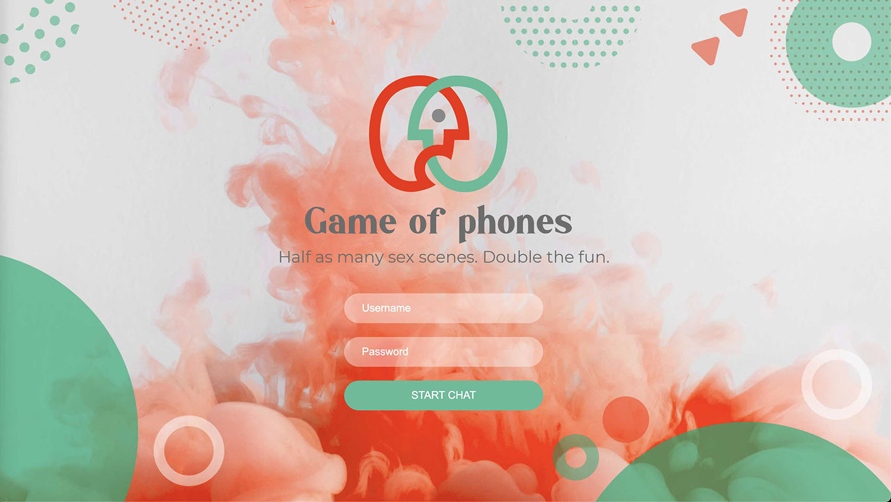
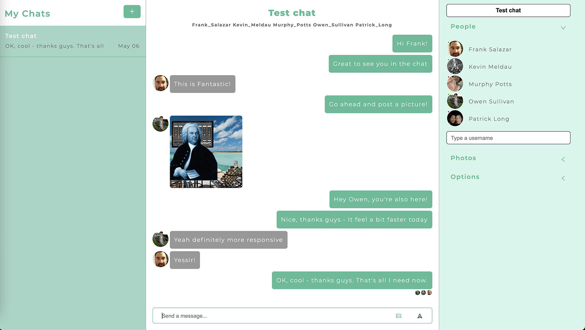

# Game of Phones

Game of Phones is a fully functional chat application that allows multiple users to chat and send images to each other.
For my final capstone project, I wanted to step out of my comfort zone and focus on functionality, rather than trying to make the app look good.

Feel free to login and test there app **[here](https://game-of-phones.vercel.app/)**. There is also a video demo of the app **[here](https://game-of-phones.vercel.app/)**.

In order to test the app, you'll need to login as a test user. Here are a list of test users you can login as:

| Username        | Password           |
| ------------- |:-------------:|
| Owen_Sullivan      | 123123 |
| Patrick_Long      | 123123 |
| Frank_Salazar      | 123123 |
| Murphy_Potts      | 123123 |

## Technology Used

1. Sass
2. React (Ant Design & Web Sockets)

**What is Websocket**
According to MDN, The WebSocket API is an advanced technology that makes it possible to **open a two-way interactive communication session** between the user's browser and a server. With this API, you can **send messages to a server and receive event-driven responses without having to poll the server** for a reply. WebSocket helps you maintain two-way communication between the client(in my case React app) and the Server.

## Functionality Highlights

4. Users can create different chat rooms
1. Users can jump into different chat rooms
2. Latest message is shown in the chat room preview
3. Users can send images in chat
8. Display shows what images have been uploaded to chat during the duration of the chat
5. Users can see when their message has been read
6. Display shows user messages on the right, and other users messages on the left
7. Display shows currently logged in users
9. Ability to register and delete users (admin only)
10. Ability to upload profile images (admin only)

### Screen Shots

**Screen shot - Login screen**

**Screen shot - Chat window**

